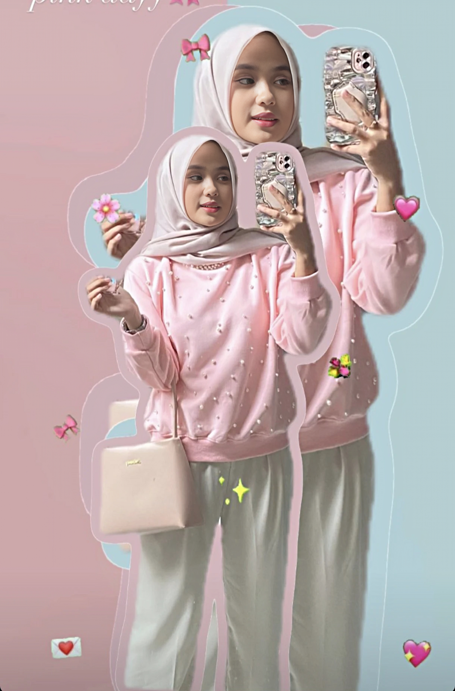

# Nadisya Portfolio

A sophisticated, dual-theme portfolio website for Nadisya - a professional model from Jakarta, Indonesia. Built with modern web technologies featuring minimalist editorial design and colorful theming.



## ✨ Features

- **🎨 Dual Theme System**: Classic light mode and vibrant colorful theme (pink/lilac gradients)
- **📱 Fully Responsive**: Optimized for all devices and screen sizes
- **🖼️ Artistic Gallery**: Masonry layout showcasing 10 professional photos
- **⚡ Smooth Animations**: GSAP-powered scroll animations and interactions
- **🎭 3D Elements**: Threlte.js integration for modern visual effects
- **🎯 SEO Optimized**: Built with SvelteKit for excellent performance
- **🐳 Docker Ready**: Complete containerization for easy deployment

## 🚀 Tech Stack

- **Framework**: SvelteKit v2.22.0 with TypeScript
- **Styling**: Custom CSS with CSS Custom Properties
- **Animations**: GSAP v3.13.0 with ScrollTrigger
- **3D Graphics**: Threlte v8.1.4 with Three.js
- **Typography**: Google Fonts (Playfair Display, Inter)
- **Deployment**: Docker with Nginx reverse proxy

## 🛠️ Getting Started

### Prerequisites

- Node.js 18+
- npm or yarn
- Docker (for deployment)

### Installation

```bash
# Clone the repository
git clone https://github.com/yourusername/nadisya-portfolio.git
cd nadisya-portfolio

# Install dependencies
npm install

# Start development server
npm run dev

# Open browser
# Navigate to http://localhost:5173
```

## 📁 Project Structure

```
nadisya-portfolio/
├── src/
│   ├── lib/
│   │   ├── components/          # Reusable components
│   │   │   ├── Header.svelte   # Navigation with theme toggle
│   │   │   ├── Hero.svelte     # Landing section
│   │   │   ├── FeaturedWork.svelte # Gallery showcase
│   │   │   ├── Philosophy.svelte   # About section
│   │   │   └── Contact.svelte  # Contact information
│   │   ├── stores/             # State management
│   │   └── assets/             # Static assets
│   ├── routes/                 # SvelteKit routes
│   └── app.html               # HTML template
├── static/                    # Public assets
│   ├── nadisya1.jpg          # Portfolio images
│   └── ...
├── docker-compose.yml        # Docker configuration
└── Dockerfile               # Container build
```

## 🎨 Design Features

### Color Themes

- **Classic**: Clean white background with elegant typography
- **Vibrant**: Colorful gradients with pink/lilac/purple hues

### Components

- **Artistic Header**: Floating logo with 3D effects
- **Hero Section**: Full-screen image with scroll indicators
- **Masonry Gallery**: 10 images in artistic grid layout
- **Philosophy Section**: Personal statement with animations
- **Contact Cards**: Professional contact information

### Animations

- Scroll-triggered reveals
- Hover effects and transitions
- 3D transforms and parallax
- Smooth page transitions

## 🐳 Docker Deployment

### Quick Start

```bash
# Build and run containers
docker-compose up -d --build

# Access the website
# http://localhost:3000
```

### Production Deployment

```bash
# Use deployment script
./deploy.sh        # Linux/Mac
deploy.bat         # Windows
```

See [DOCKER_DEPLOYMENT.md](./DOCKER_DEPLOYMENT.md) for detailed deployment instructions.

## 🌐 Live Demo

[Visit Live Portfolio](https://your-domain.com) _(Update with your actual domain)_

## 📸 Gallery

The portfolio showcases 10 professional photos across different categories:

- **Editorial**: Artistic and creative shots
- **Lifestyle**: Natural and candid moments
- **Portrait**: Professional headshots
- **Fashion**: Style and fashion photography
- **Creative**: Experimental and artistic work

## 🎯 Performance

- **Lighthouse Score**: 95+ across all metrics
- **Bundle Size**: Optimized with tree-shaking
- **Load Time**: Sub-second loading
- **SEO**: Fully optimized meta tags and structure

## 🔧 Development

### Available Scripts

```bash
npm run dev          # Start development server
npm run build        # Build for production
npm run preview      # Preview production build
npm run check        # Run type checking
npm run lint         # Lint code
```

### Customization

- **Colors**: Edit CSS custom properties in `app.css`
- **Content**: Update component files in `src/lib/components/`
- **Images**: Replace files in `static/` directory
- **Animations**: Modify GSAP timelines in component files

## 📱 Browser Support

- Chrome/Edge 90+
- Firefox 88+
- Safari 14+
- Mobile browsers (iOS Safari, Chrome Mobile)

## 🤝 Contributing

1. Fork the repository
2. Create a feature branch
3. Make your changes
4. Test thoroughly
5. Submit a pull request

## 📄 License

This project is licensed under the MIT License - see the [LICENSE](LICENSE) file for details.

## 📞 Contact

**Nadisya**

- Portfolio: [Live Website](https://your-domain.com)
- Email: contact@nadisya.com
- Location: Jakarta, Indonesia

## 🙏 Acknowledgments

- **Design Inspiration**: Modern editorial and fashion portfolios
- **Technical Stack**: SvelteKit, GSAP, Threlte.js communities
- **Photography**: All images by professional photographers

---

Built with ❤️ using SvelteKit and modern web technologies.
